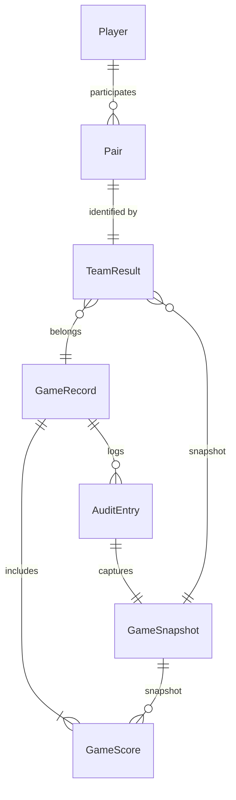

# Burako Scorekeeper Data Model

## Core Entities

- **Players (`Player`)**
  - Fields: `id`, `name`
  - Four fixed participants across the season.
  - `id` values referenced by every other entity (pairs, scores, leaderboard).

- **Pairs (`Pair`)**
  - Fields: `id`, `players: [PlayerId, PlayerId]`
  - Encodes partner combinations. All valid two-player combinations are pre-generated to support enforcement of unique team assignments per game.

- **Games (`GameRecord`)**
  - Fields: `id`, `playedAt`, `teams`, `scores`, `notes`, `auditTrail`
  - `playedAt` captured in ISO-8601 for consistent sorting and future range queries.
  - `teams` stores two `TeamResult` entries, each pointing to a `Pair`.
  - `scores` stores per-player totals for flexible analytics (games may be recorded per player or per team).
  - `auditTrail` captures modification history for edit/undo.

- **Team Results (`TeamResult`)**
  - Fields: `pairId`, `totalPoints`, `canasta`
  - `canasta` embeds detailed breakdown to support future automated scoring (clean/dirty counts, bonuses).

- **Audit Entries (`AuditEntry`)**
  - Fields: `id`, `gameId`, `timestamp`, `summary`, `type`, `snapshot`
  - `type` ∈ {`create`, `update`, `undo`} to distinguish operations.
  - `snapshot` is a `GameSnapshot`, storing teams, scores, notes, enabling revert operations and audit replay.

- **Snapshots (`GameSnapshot`)**
  - Captures immutable representation of a game state, used for undo and audit trail presentation.

- **Leaderboard (`LeaderboardEntry`)**
  - Fields: `playerId`, `totalPoints`, `gamesPlayed`, `averagePoints`, `lastPlayedAt`
  - Calculated dynamically via `calculateLeaderboard()` to avoid duplication.

## Relationships

## Future Canasta Scoring

- `CanastaDetails` currently stores `cleanCanastas`, `dirtyCanastas`, `bonusPoints` per team.
- `useCanastaScoring()` returns a stub `calculate()` method. Future work will:
  - Apply official scoring formulas based on canasta counts, hand value, and bonuses.
  - Validate consistency between per-player points and computed team totals.

## Persistence Strategy

- **Local storage** via `LocalScoreRepository` for offline-ready PWA behavior.
- Repository interface `ScoreRepository` abstracts access to enable migration to Supabase/Firebase; future persistence layer must implement identical methods (`listPlayers`, `listPairs`, `listGames`, `addGame`, `updateGame`, `undoLastChange`).

## Extension Notes

- Add authentication by layering access control on repository calls; audit entries already capture user-readable history.
- For Supabase/Firebase, map entities to tables/collections:
  - `players` (static), `pairs` (static), `games`, `team_results`, `scores`, `audits`.
  - `GameSnapshot` can be stored as JSON for each audit entry.
- Consider indexing `playedAt` and `playerId` for efficient history filtering and leaderboard queries.
